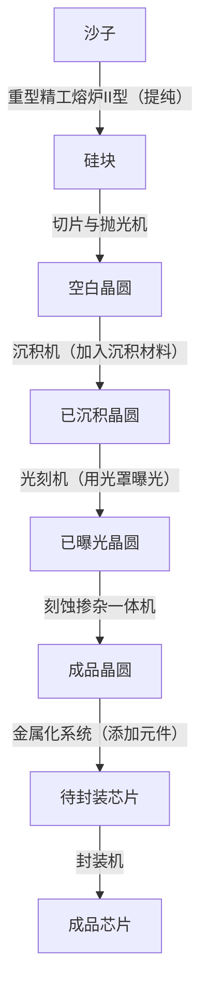

# 工业产线/光刻技术产线

## 流程
**是简化后的流程，同时考虑了娱乐性。与现实生活中的流程不同。**

下方的流程图加载需要一些时间，请耐心等待。 
<mark>如果等待较长时间后仍没有显示流程图，则考虑检查你的网络环境和更新浏览器版本。</mark>

```mermaid
flowchart TD
    A[沙子] --重型精工熔炉II型（提纯）--> B[硅块]
    B --切片与抛光机--> C[空白晶圆]
    C --沉积机（加入沉积材料）--> D[已沉积晶圆]
    D --光刻机（用光罩曝光）--> E[已曝光晶圆]
    E --刻蚀掺杂一体机--> I[成品晶圆]
    I --金属化系统（添加元件）--> J[待封装芯片]
    J --封装机--> K[成品芯片]
```