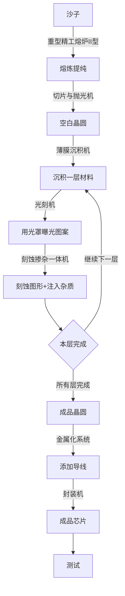

# 工业产线/光刻技术产线

## 流程
**是简化后的流程，同时考虑了娱乐性。与现实生活中的流程不同**

```mermaid
flowchart TD
    A[沙子] --重型精工熔炉II型--> B[熔炼提纯]
    B --切片与抛光机--> C[空白晶圆]

    C --薄膜沉积机--> D[沉积一层材料]
    D --光刻机--> E[用光罩曝光图案]
    E --刻蚀掺杂一体机--> F[刻蚀图形+注入杂质]
    F --> G{本层完成}
    G -- 继续下一层 --> D
    G -- 所有层完成 --> I

    I[成品晶圆] --金属化系统--> J[添加导线]
    J --封装机--> K[成品芯片]
    K --> L[测试]
```
